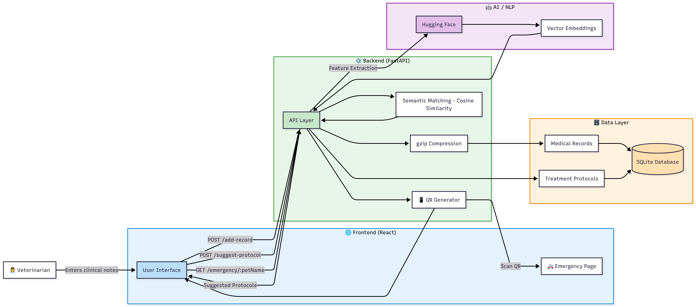

# 🐾 Veterinary Practice Manager

## Overview
Veterinary Practice Manager is a lightweight, AI-assisted veterinary support system designed to improve the speed and efficiency of accessing animal medical information.

The system stores compressed medical records, performs semantic search over predefined treatment protocols, and provides AI-based protocol suggestions based on the meaning of a veterinarian’s clinical notes. QR codes enable instant emergency access to critical information.

## Problem Statement
Veterinary clinics often deal with unstructured medical notes and time-consuming protocol lookup. This project addresses the question:
**Given a medical note written by a vet, which treatment protocol is the most relevant?**

## Key Features
- Semantic search based on meaning, not keywords
- AI-assisted treatment protocol suggestions
- Gzip-compressed medical records for lightweight storage
- QR code generation for emergency access
- Fast and minimal architecture

## Why AI?
AI is used only to understand the semantic meaning of medical notes. It does not diagnose or replace veterinary judgment.

## Semantic Search
Semantic search compares the meaning of text instead of exact words. This allows the system to match clinical notes with relevant protocols even when the wording differs.

## Protocols
Protocols are predefined veterinary treatment guidelines stored in the system and suggested based on relevance.

## Technical Approach
- Feature extraction using Hugging Face `all-MiniLM-L6-v2`
- Vector embeddings stored and compared using cosine similarity
- FastAPI backend with SQLite database
- React frontend with emergency access page

## Architecture
Vet Note → Embedding → Similarity Matching → Protocol Suggestion  
QR Code → Emergency Page → Backend API

## Tech Stack
Backend: FastAPI, SQLite, Hugging Face API  
Frontend: React (Vite), React Router  
AI: Sentence Transformers, cosine similarity

## How to Run
Backend:
```
pip install -r requirements.txt
uvicorn main:app --reload
```

Frontend:
```
npm install
npm run dev
```

## System Architecture

